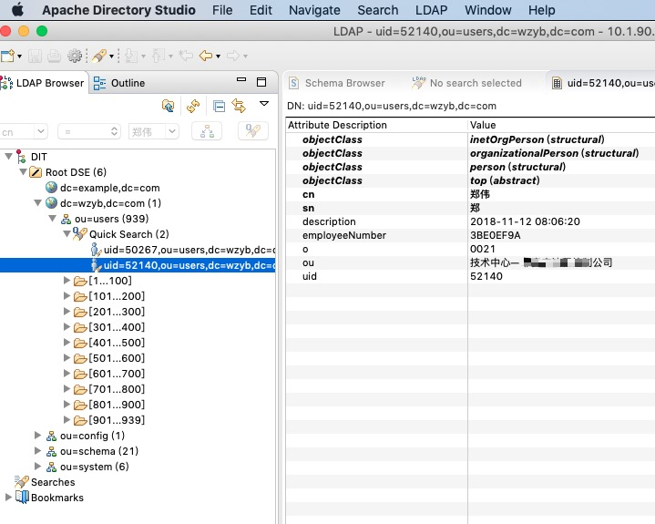

# hy.common.ldap


LDAP目录服务的操作类库。基于 Apache LDAP API。

可用于OpenLDAP目录服务的访问操作。


__主导思想：__ 通过 @Ldap 注解十分方便的实现Java写入、读取LDAP目录服务中的数据，同时不破坏、不改造Java程序原有的数据结构。

  __特点1：__ 使用LDAP连接池操作LDAP目录服务。

  __特点2：__ 内部自动获取连接，自动释放连接，无须外界干预。

  __特点3：__ 可用XML配置文件配置，如下（见LDAP.Config.Template.xml 基于：Apache LDAP API 2.0.0.AM2）
  
（基于：Apache LDAP API 1.0.0-RC2的见 JU_LDAP_V1.xml ）

__特点4：__ 支持同一属性多个属性值的LDAP特性的转换。 
  
  Java对象用List<Object>或Set<Object>或数组Object[]定义成员变量的类型，来支持多属性值的LDAP特性

### 配置LDAP连接池的XML样例


```xml
	<?xml version="1.0" encoding="UTF-8"?>

	<config>
	
		<import name="xconfig"         class="java.util.ArrayList" />
		<import name="connConfig"      class="org.apache.directory.ldap.client.api.LdapConnectionConfig" />
		<import name="connFactory"     class="org.apache.directory.ldap.client.api.DefaultLdapConnectionFactory" />
		<import name="poolConfig"      class="org.apache.commons.pool2.impl.GenericObjectPoolConfig" />
		<import name="connPool"        class="org.apache.directory.ldap.client.api.LdapConnectionPool" />
		<import name="connPoolFactory" class="org.apache.directory.ldap.client.api.ValidatingPoolableLdapConnectionFactory" />
		<import name="ldap"            class="org.hy.common.ldap.LDAP" />
		
		
		
		<!-- Apache LDAP API配置信息（可支持对OpenLDAP服务的连接） -->
		<xconfig>
		
			<!-- 连接基本配置 -->
			<connConfig id="LDAPConnConfig">
				<ldapHost>127.0.0.1</ldapHost>               <!-- LDAP服务器IP -->
				<ldapPort>389</ldapPort>                     <!-- 访问端号 -->
				<name>cn=Manager,dc=maxcrc,dc=com</name>     <!-- RootDN 用户名称 -->
				<credentials>secret</credentials>            <!-- RootPW 用户密码 -->
			</connConfig>
			
			
			<!-- LDAP连接工厂 -->
			<connFactory id="LDAPConnFactory">
				<constructor>
					<connConfig ref="LDAPConnConfig" />
				</constructor>
				
				<timeOut>30000</timeOut>
			</connFactory>
			
			
			<!-- 连接池参数，下面都是默认值，即可不设置这些参数 -->
			<poolConfig id="LDAPPoolConfig">
				<lifo>true</lifo>
				<maxWait>-1</maxWait>
				<maxActive>8</maxActive>
				<maxIdle>8</maxIdle>
				<minIdle>0</minIdle>
				<minEvictableIdleTimeMillis>1800000</minEvictableIdleTimeMillis>    <!-- 30分钟 -->
				<numTestsPerEvictionRun>3</numTestsPerEvictionRun>
				<softMinEvictableIdleTimeMillis>-1</softMinEvictableIdleTimeMillis>
				<testOnBorrow>false</testOnBorrow>
				<testOnReturn>false</testOnReturn>
				<testWhileIdle>false</testWhileIdle>
				<timeBetweenEvictionRunsMillis>-1</timeBetweenEvictionRunsMillis>
				<whenExhaustedAction>1</whenExhaustedAction>
			</poolConfig>
			
			
			<!-- 构建LDAP连接池 -->
			<connPool id="LDAPConnPool">
				<constructor>
					<connPoolFactory>
						<constructor>
							<connFactory ref="LDAPConnFactory" />
						</constructor>
					</connPoolFactory>
					
					<poolConfig ref="LDAPPoolConfig" />
				</constructor>
			</connPool>
			
			
			<!-- 构建LDAP统一操作类 -->
			<ldap id="LDAP">
				<constructor>
					<connPool ref="LDAPConnPool" />
				</constructor>
			</ldap>
			
		</xconfig>
	
	</config>
```


### 定义"条目翻译官"的代码样例
条目翻译官有两种作用

  __作用1：__ 将Java值对象翻译为LDAP条目
  
  __作用2：__ 将LDAP条目翻译为Java值对象的实例

```java
/** 定义ObjectClass。多个类名用英文逗号分隔。 */
@Ldap("top ,organizationalUnit")
public class User
{
    
	/** 定义DN */
	@Ldap(type=LdapType.DN)
	private String id;
	
	/** 当 LdapType.DN "uid=xx,dc=example,dc=com" 时，在查询时，uid将自动赋值。在写入时，也不用特意赋值 */
	@Ldap("uid")
	private String uid;

	/** 定义属性ou */
	@Ldap(name="ou")
	private String name;
    
	/** 定义属性userPassword */
	@Ldap("userPassword")
	private String password;
    
	/** 定义属性street */
	@Ldap("street")
	private String address;
    
	/** 支持多个属性值的LDAP特性：字符类型的集合 */
	@Ldap("cn")
	private List<String> name;
	
	/** 支持多个属性值的LDAP特性：日期类型的集合，LDAP目录数据库中的属性值可以是字符串类型的 */
	@Ldap("description")
	private List<Date>   timeList;
	
	/** 支持多个属性值的LDAP特性：万能元素类型的集合 */
	@Ldap("localityName")
	private List<?>      dataList;
	
	/** 支持多个属性值的LDAP特性：字符类型的数组 */
	@Ldap("telephoneNumber")
	private String []    tel;
	
	/** 支持多个属性值的LDAP特性：日期类型的数组，LDAP目录数据库中的属性值可以是字符串类型的 */
	@Ldap("gn")
	private Date   []    times;

    
    
	public String getId()
	{
	    return id;
	}
	
	public void setId(String id)
	{
	    this.id = id;
	}
	
	public String getName()
	{
	    return name;
	}
	
	public void setName(String name)
	{
	    this.name = name;
	}
	
	public String getPassword()
	{
	    return password;
	}
	
	public void setPassword(String password)
	{
	    this.password = password;
	}
	
	public String getAddress()
	{
	    return address;
	}
	
	public void setAddress(String address)
	{
	    this.address = address;
	}
	
	/**
	 * 获取：当 LdapType.DN personNo="uid=xx,dc=example,dc=com" 时，在查询时，uid将自动赋值。在写入时，也不用特意赋值
	 */
	public String getUid()
	{
	    return uid;
	}
	
	/**
	 * 设置：当 LdapType.DN personNo="uid=xx,dc=example,dc=com" 时，在查询时，uid将自动赋值。在写入时，也不用特意赋值
	 * 
	 * @param uid 
	 */
	public void setUid(String uid)
	{
	    this.uid = uid;
	}
	
	/**
	 * 获取：支持多个属性值的LDAP特性：字符类型的集合
	 */
	public List<String> getName()
	{
	    return name;
	}
	
	/**
	 * 设置：支持多个属性值的LDAP特性：字符类型的集合
	 * 
	 * @param name 
	 */
	public void setName(List<String> name)
	{
	    this.name = name;
	}
	
	/**
	 * 获取：支持多个属性值的LDAP特性：日期类型的集合，LDAP目录数据库中的属性值可以是字符串类型的
	 */
	public List<Date> getTimeList()
	{
	    return timeList;
	}
	
	/**
	 * 设置：支持多个属性值的LDAP特性：日期类型的集合，LDAP目录数据库中的属性值可以是字符串类型的
	 * 
	 * @param timeList 
	 */
	public void setTimeList(List<Date> timeList)
	{
	    this.timeList = timeList;
	}
	
	/**
	 * 获取：支持多个属性值的LDAP特性：万能元素类型的集合
	 */
	public List<?> getDataList()
	{
	    return dataList;
	}
	
	/**
	 * 设置：支持多个属性值的LDAP特性：万能元素类型的集合
	 * 
	 * @param dataList 
	 */
	public void setDataList(List<?> dataList)
	{
	    this.dataList = dataList;
	}
	
	/**
	 * 获取：支持多个属性值的LDAP特性：字符类型的数组
	 */
	public String [] getTel()
	{
	    return tel;
	}
	
	/**
	 * 设置：支持多个属性值的LDAP特性：字符类型的数组
	 * 
	 * @param tel 
	 */
	public void setTel(String [] tel)
	{
	    this.tel = tel;
	}
	
	/**
	 * 获取：支持多个属性值的LDAP特性：日期类型的数组，LDAP目录数据库中的属性值可以是字符串类型的
	 */
	public Date [] getTimes()
	{
	    return times;
	}
	
	/**
	 * 设置：支持多个属性值的LDAP特性：日期类型的数组，LDAP目录数据库中的属性值可以是字符串类型的
	 * 
	 * @param times 
	 */
	public void setTimes(Date [] times)
	{
	    this.times = times;
	}
}
```


### 添加条目Entry的代码样例

```java
	LDAP v_LDAP = (LDAP)XJava.getObject("LDAP");    // 获取LDAP访问的操作类（带连接池功能的）
	        
	User v_User = new User();
	v_User.setId(      "ou=ZhengWei,dc=maxcrc,dc=com");
	v_User.setName(    "ZhengWei");
	v_User.setPassword("1234567890");
	
	boolean v_Ret = v_LDAP.addEntry(v_User);
```

	
	
### 批量添加条目Entry的代码样例

  注1：有顺序的添加。可实现先添加父条目，再添加子条目的功能

  注2：集合中的每个元素可以是不同类型的，对应不同类型的LDAP类。

```java
	LDAP         v_LDAP   = (LDAP)XJava.getObject("LDAP");
	User         v_User01 = new User();
	User         v_User02 = new User();
	List<Object> v_Values = new ArrayList<Object>();
	
	v_User01.setId(      "ou=Batch01,dc=maxcrc,dc=com");
	v_User01.setName(    "Batch01");
	v_User01.setPassword("1234567890");
	
	v_User02.setId(      "ou=Batch02,dc=maxcrc,dc=com");
	v_User02.setName(    "Batch02");
	v_User02.setPassword("0987654321");
	
	v_Values.add(v_User01);
	v_Values.add(v_User02);
	
	boolean v_Ret = v_LDAP.addEntrys(v_Values);
```


### 查询具体条目Entry的代码样例

```java
	LDAP v_LDAP = (LDAP)XJava.getObject("LDAP");
	User v_User = (User)v_LDAP.queryEntry("ou=ZhengWei,dc=maxcrc,dc=com");          // 参数也可为User对象
```


### 查询子条目Entry(不包含子子条目)的代码样例

```java
	LDAP       v_LDAP   = (LDAP)XJava.getObject("LDAP");
	List<User> v_Entrys = (List<User>)v_LDAP.queryEntryChilds("dc=maxcrc,dc=com");  // 参数也可为User对象
```


### 查询所有子条目Entry的代码样例

```java
	LDAP       v_LDAP   = (LDAP)XJava.getObject("LDAP");
	List<User> v_Entrys = (List<User>)v_LDAP.queryEntryTrees("dc=maxcrc,dc=com");   // 参数也可为User对象
```


### 判定条目Entry是否存在的代码样例

```java
	LDAP    v_LDAP     = (LDAP)XJava.getObject("LDAP");
	boolean v_IsExists = v_LDAP.isExists("ou=ZhengWei,dc=maxcrc,dc=com");
```


### 删除条目Entry的代码样例

```java
    LDAP    v_LDAP = (LDAP)XJava.getObject("LDAP");
	boolean v_Ret  = v_LDAP.delEntry("ou=ZhengWei,dc=maxcrc,dc=com");
```


### 批量删除条目Entry的代码样例

```java
    LDAP         v_LDAP = (LDAP)XJava.getObject("LDAP");
    List<String> v_DNs  = new ArrayList<String>();  
    
    v_DNs.add("ou=Batch01,dc=maxcrc,dc=com");
    v_DNs.add("ou=Batch02,dc=maxcrc,dc=com");
    
    boolean v_Ret = v_LDAP.delEntrys(v_DNs);
```


### 删除条目Entry树(递归删除条目)的代码样例

```java
	LDAP    v_LDAP = (LDAP)XJava.getObject("LDAP");
	boolean v_Ret  = v_LDAP.delEntryTree("ou=ZhengWei,dc=maxcrc,dc=com");
```


### 对条目Entry的属性进行修改(添加属性、删除属性、修改属性值)的代码样例

```java
    LDAP    v_LDAP = (LDAP)XJava.getObject("LDAP");
    User    v_User = new User();
    boolean v_Ret  = false;
    
    v_User.setId(      "ou=ZhengWei,dc=maxcrc,dc=com");
    v_User.setName(    "ZhengWei");
    v_User.setPassword("改密码：ABC");
    v_User.setAddress( "新属性：西安");
    
    v_Ret = v_LDAP.addAttributes(v_User);     // 自动识别要添加的多个属性
    v_Ret = v_LDAP.modifyAttributes(v_User);  // 自动识别要修改的多个属性
    
    v_User.setAddress(null);                  // 置Null即为删除
    v_Ret = v_LDAP.delAttributes(v_User);     // 自动识别要删除的多个属性
```


### 实战案例：从关系型数据库"拉"数据，并"推"到ApacheDS服务上。

* [案例代码](test/org/hy/common/ldap/junit/dbtoldap)
* 案例代码说明

	| 文件名称 | 说明 |
	|:------------------ |:---------------------------------- |
	| JU_DBToLDAP.java   | 启动测试类                           |
	| UserInfo.java      | 值对象及条目翻译官                    |
	| IUserDAO.java      | 关系型数据库的操作类DAO，如查询用户信息  |
	| db.sql.xml         | 查询SQL语句的配置文件                 |
	| sys.DB.Config.xml  | 关系型数据库的连接配置。               |
	| sys.LDAP.Cnfig.xml | ApacheDS服务器的连接配置。            |
	
* 案例结果



---
#### 本项目引用Jar包，其源码链接如下
引用 https://github.com/HY-ZhengWei/hy.common.base 类库

引用 https://github.com/HY-ZhengWei/hy.common.file 类库

引用 https://github.com/HY-ZhengWei/XJava 类库
